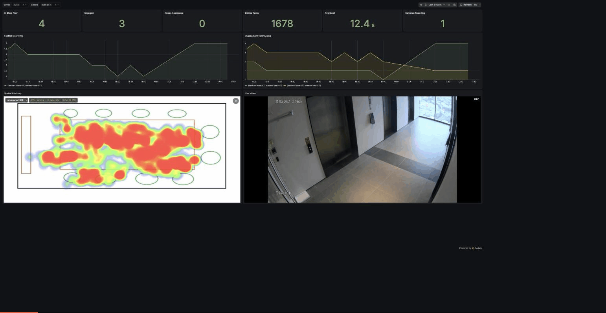

# retail-vision

**Retail footfall analytics that runs the same tracking code on Hailo-8, Jetson, Rockchip NPU and reCamera.**

[](https://github.com/Seeed-Solution/retail-vision/actions/workflows/ci.yml)
[](LICENSE)
[](#verified-on-hardware)
[](#verified-on-hardware)
[](#verified-on-hardware)
[](#verified-on-hardware)



## What is this

Point it at an RTSP camera and it tells you how many people are in the room, which
ones are browsing, which have stopped in front of something, and where they stand —
as a live Grafana dashboard with a floor-plan heatmap and the camera feed beside it.

The part that is unusual: the tracker, the dwell state machine, the rolling zone
metrics and the MQTT publisher are **one implementation shared across four
accelerator families**. A backend supplies a frame source and a `detect()` call;
nothing else differs. All four have been run on real hardware against live RTSP,
and their output validates against a single contract.

## Key features

- **Four accelerators, one behaviour.** Hailo-8, NVIDIA TensorRT, Rockchip RKNN and
  the reCamera's CV181x TPU. A shopper judged `engaged` on one board is judged
  `engaged` on all of them, because it is the same code deciding.
- **Video never leaves the camera.** Detectors publish counts, dwell states and
  normalised coordinates over MQTT — no frames, no crops. The dashboard's live view
  comes straight from the camera's own RTSP, converted to WebRTC by the gateway.
- **Cameras find themselves.** An ONVIF WS-Discovery probe locates cameras on the
  network and reads their stream URLs; nothing is typed in by hand on a normal LAN.
- **One batched message per second per camera**, not one per detected person per
  frame. Message rate stays flat as people and cameras are added.
- **Small images.** 194 MB (Rockchip), 233 MB (Jetson), 370 MB (Hailo). Vendor
  runtimes are mounted from the host rather than baked in, so a driver update on
  the board cannot silently desync from the library in the image.
- **Ships with the dashboard.** InfluxDB, Grafana, MQTT broker, floor-plan heatmap
  and the video gateway come up as one compose stack.

## Quickstart

```bash
git clone https://github.com/Seeed-Solution/retail-vision.git
cd retail-vision

# the analytics backend: broker, InfluxDB, Grafana, heatmap, video gateway
docker compose -f backend/docker-compose.yml up -d

# the detector, on the board that has the accelerator
cd boards/rk3588 && docker compose up -d      # or rk3576 / rpi5-hailo / orin
```

Then open `http://<host>:3000` for the dashboard and `http://<host>:1984` for the
video gateway. Point `mqtt.host` in the board's `config/config.json` at the backend
if it runs on a different machine.

## Verified on hardware

Every row is a real board watching a live RTSP source, with its MQTT output checked
by `contracts/validate_payload.py`. **Zero invalid messages on all four.**

| Board | Accelerator | Pipeline | Inference | MQTT | Image |
|---|---|---|---|---|---|
| reComputer RK3588 | RKNPU v2 | 13.2 fps | 57 ms | 1.00 msg/s | 194 MB |
| reComputer RK3576 | RKNPU | 13.3 fps | 53 ms | 1.00 msg/s | 194 MB |
| Raspberry Pi 5 + Hailo-8 | Hailo-8 | 15.7 fps | **6.4 ms** | 0.95 msg/s | 370 MB |
| Jetson AGX Orin | TensorRT 10.3 | 15.0 fps | 12.2 ms | 0.99 msg/s | 233 MB |
| reCamera 2002 | CV181x TPU | 10.0 fps | 49 ms | configurable | on-device app |

Pipeline rates are source-limited: the Hailo pipeline reaches 234 fps unpaced and
the Jetson detector 81.8 fps, roughly 15x and 5x the camera's frame rate.

## How it works

```
camera (RTSP) ──► detector ──► MQTT ──► Telegraf ──► InfluxDB ──► Grafana
                                                                    ▲
                  camera (RTSP) ──► go2rtc ──► WebRTC ──────────────┘
```

Detectors only ever publish analytics. The picture reaches the browser on a separate
path, straight from the camera through the gateway, so adding a viewer costs the
detector nothing and the analytics path carries no video.

### Layout

```
backend/              the analytics stack: broker, InfluxDB, Grafana, heatmap,
                      video gateway — one compose file
contracts/            vision-payload.schema.json + a dependency-free validator
core-py/retail_core/  tracker · dwell · zone_metrics · payload · publisher · video
core-cpp/             person_tracker · zone_metrics · mqtt_payload · geometry
backends/rknn/        RKNN Lite detector + mppvideodec source          (Python)
backends/tensorrt/    TensorRT via ctypes over libcudart               (Python)
backends/hailo/       hailonet detector + GStreamer                    (C++)
boards/               config and models only — no code
```

A backend implements exactly two things: a frame source, and
`detect(frame) -> [DetectionBox]`.

### Why the split is drawn here

The obvious alternative — one implementation per platform — is what a sibling
project did, and it ended up with four copies of the tracker and publisher that
drift apart. The same shopper then reads `engaged` on one board and `dwelling` on
another, and that class of bug is very hard to chase. So the line follows what
actually varies with the hardware:

| Layer | Shared? | Why |
|---|---|---|
| `contracts/` | across everything | language-neutral schema and validator |
| `core-py/`, `core-cpp/` | per language family | takes boxes and timestamps, touches no vendor SDK |
| `backends/` | never | tensor layouts, pre/post-processing and ABI-locked host libraries all differ |
| `boards/` | never | config and model files only |

Two implementations of the same logic (Python and C++) are held together by
`core-py/retail_core/tests/fixtures/tracker_sequence.json` — 330 frames with 8
assertions derived from the C++ rules, covering id assignment, dwell thresholds,
identity across a 5-frame occlusion, edge-vs-centre loss timeouts and entry/exit
counts. Feeding the same fixture to a C++ harness must reproduce the same columns.

`core-cpp/` is shared verbatim with the reCamera SG2002 build:
`mqtt_payload.*`, `zone_metrics.*` and `geometry.h` are byte-identical to it, and
`person_tracker.*` differ by one include line each so the file builds without the
SG2002 SDK.

### The Jetson backend talks to TensorRT directly

Running the `.engine` through Ultralytics pulls torch (750 MB), polars (154 MB),
scipy (109 MB), onnx (77 MB) and sympy (57 MB) into the image — 1.15 GB of
dependencies to execute a plan the host's own TensorRT can execute, and whose Python
bindings the compose file already mounts into the container.

Calling TensorRT directly needs a CUDA allocator, and the usual candidates are worse
than the problem: pycuda compiles from source on the board, cuda-python is another
wheel to pin, and torch is what we are removing. `cuda_rt.py` is ~100 lines of ctypes
over the host's `libcudart` instead — no pip dependency at all. The image went from
2.4 GB to 233 MB and throughput rose from 63.7 to 81.8 fps, because the torch tensor
round-trip is gone. Detection output is unchanged: over 200 identical frames, 600
detections against 600, IoU 1.00000 at the 1st percentile, zero score delta.

Three things about Ultralytics engines that are not documented anywhere obvious:

- The exported `.engine` is **not** a bare TensorRT plan. It is
  `<4-byte LE length><JSON metadata><plan>`; handing the whole file to
  `deserializeCudaEngine` fails a magic-tag assertion.
- The head is raw `[1, 84, 8400]` — cx, cy, w, h in input pixels plus 80 sigmoid
  class scores. Decode and NMS are ours, ~40 lines of numpy.
- The image needs `ENV NVIDIA_VISIBLE_DEVICES=all`. A CUDA base image inherits it;
  a plain `ubuntu:22.04` does not, and without it the nvidia runtime injects no
  `/dev/nvmap` and TensorRT dies with CUDA error 999 even though `--runtime nvidia`
  was passed.

The CUDA stream is created with `cudaStreamNonBlocking` and host staging is
page-locked. A stream from plain `cudaStreamCreate` implicitly synchronises with the
legacy default stream, so one detector per camera would serialise against every other
one — no error, just throughput that vanishes when a second camera is added. A
pageable copy buffer makes the driver route transfers through its own staging area,
so an "async" copy cannot overlap with compute.

> `backend/grafana/dashboards/recamera-heatmap.json` keeps its original filename so
> that already-deployed Grafana instances keep the same dashboard UID across an
> upgrade. It is the dashboard for every backend, not just the reCamera one.

## The MQTT contract

```
<installation>/retail-vision/results/<camera-id>   batched analytics, 1 Hz
<installation>/retail-vision/status                online / offline, retained
```

```json
{
  "timestamp": 1709500000000, "frame_width": 1280, "frame_height": 720,
  "zone": {"occupancy_count": 3, "browsing_count": 1, "engaged_count": 1,
           "assist_count": 0, "avg_dwell_time": 8.5,
           "entry_count": 12, "exit_count": 10},
  "persons": [{"slot": 0, "track_id": 7, "state": "engaged",
               "cx_pct": 41.2, "cy_pct": 63.8, "dwell_duration": 5.2}]
}
```

`slot` is the person's index within the batch, and it is load-bearing: everyone in
one message shares the top-level timestamp, so a time-series store keyed on
(topic, timestamp) alone collapses a frame's people into a single row. It is the
index rather than `track_id` because `track_id` grows for the life of the deployment
and would make the tag set unbounded.

Validate a capture against the contract with no dependencies:

```bash
mosquitto_sub -h <broker> -t '+/retail-vision/results/+' | \
  python3 contracts/validate_payload.py
```

## Models and their licences

**No model weights are distributed with this repository.** They are downloaded at
deploy time from their upstream sources, and **each carries its own licence, separate
from this project's Apache-2.0 grant. Reviewing and complying with those licences is
the user's responsibility.**

| Backend | Model | Origin | Licence to check |
|---|---|---|---|
| Rockchip | `yolo11n_pose_rawhead_fp16.rk*.rknn` | converted from Ultralytics YOLO11n-pose | Ultralytics — AGPL-3.0 or a commercial licence |
| Hailo | `yolov8n.hef` | Hailo Model Zoo, compiled from YOLOv8n | Hailo Model Zoo terms **and** the upstream Ultralytics licence |
| Jetson | `yolo11n.engine` | exported on the board from Ultralytics YOLO11n | Ultralytics — AGPL-3.0 or a commercial licence |
| reCamera | `yolo11n_detection_cv181x_int8.cvimodel` | Ultralytics YOLO11n compiled for CV181x | Ultralytics — AGPL-3.0 or a commercial licence |

AGPL-3.0 has obligations that reach network-facing deployments. If that does not suit
your use, Ultralytics sells a commercial licence, or you can retrain and convert a
model whose licence you control — the backends take any detector that produces
person boxes, so substituting one touches only the model file and the config.

## Before you expose it

The backend ships with working defaults so `docker compose up` produces a running
dashboard, and those defaults are **public knowledge because they are in this
repository**: the InfluxDB admin token is `recamera-heatmap-token`, the Grafana
login is `admin` / `admin`, and the MQTT broker allows anonymous connections.

That is fine on a closed lab network and not fine anywhere else. Before the
backend is reachable from anything you do not control, change the token
(`backend/docker-compose.yml`, `backend/telegraf/telegraf.conf`,
`backend/grafana/provisioning/datasources/influxdb.yml`, and the `INFLUX_TOKEN`
passed to the heatmap service), set a real Grafana password, and put credentials
on the broker.

## Known constraints

- **A Hailo-8 runs one application at a time.** HailoRT hands the physical device to
  a single process. Running a second Hailo app on the same board requires putting
  every consumer on the `hailort.service` multi-process scheduler, which is off by
  default.
- **ONVIF discovery is multicast** and stops at the subnet boundary. A backend on
  another network — in the cloud, say — finds nothing, and those cameras have to be
  entered by hand.
- **Counts arrive as floats.** The MQTT parser types every JSON number as float64,
  and a bucket already holding floats rejects an integer write for the same field.
  The dashboards round for display rather than the schema changing underneath
  existing deployments.

## Building

```bash
# Rockchip, on the board (a cross-device image transfer can be slower than a
# local build, so build where it runs)
docker build --target rknn -f docker/Dockerfile -t retail-vision-rknn:0.1.0 .

# Jetson, on the board
cd boards/orin && docker compose build retail-vision

# Hailo, on the board
cd boards/rpi5-hailo && docker compose build retail-vision

# core tests, no board needed
c++ -std=c++17 -Icore-cpp tools/core_selftest.cpp core-cpp/*.cpp -o /tmp/t && /tmp/t
cd core-py && python -m pytest retail_core/tests -q
```

## Acknowledgements

- [Ultralytics](https://github.com/ultralytics/ultralytics) — the YOLO models every
  backend detects with
- [Hailo Model Zoo](https://github.com/hailo-ai/hailo_model_zoo) — the compiled HEF
- [go2rtc](https://github.com/AlexxIT/go2rtc) — RTSP to WebRTC, and the ONVIF
  discovery client
- [Grafana](https://github.com/grafana/grafana), [InfluxDB](https://github.com/influxdata/influxdb),
  [Telegraf](https://github.com/influxdata/telegraf), [Mosquitto](https://github.com/eclipse/mosquitto)
  — the analytics backend
- [heatmap.js](https://github.com/pa7/heatmap.js) — the floor-plan overlay

## License

[Apache-2.0](LICENSE). Model weights are **not** covered by this licence — see
[Models and their licences](#models-and-their-licences).
